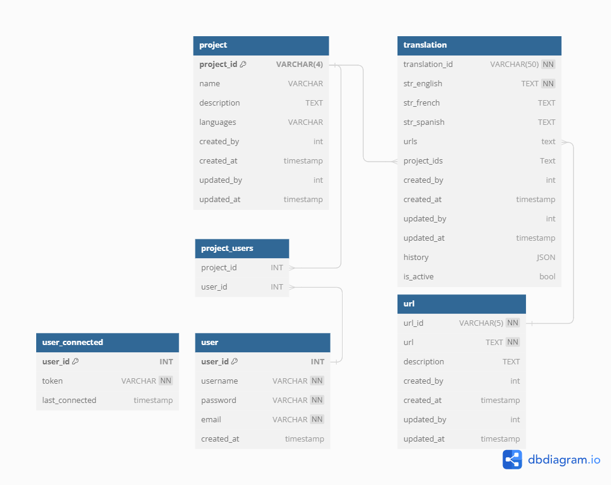

# Multilang Backend

## Overview

Multilang Backend is a Node.js application designed to handle multi-language projects. It includes various modules to manage languages, projects, translations, and URLs. The application uses Express.js for routing and includes several middleware functions for authentication, error handling.

`Warning: I have included my local .env file for testing purposes. Do not push your .env file to the repository. Make sure to add .env to your .gitignore`

DATABASE: I used cloud postgresql database. No PostgreSQL Server is needed.

## Features

1. The system allows you to register and edit projects. Additionally, you can add users to projects. This feature enables the system to send `email` notifications to the subscribed users.
2. There is a section for managing URLs.
3. There is a section for registering strings. You can link URLs and projects to the strings. When deleting a string, its status will be set to inactive. An `email` will be sent to users associated with the projects that use the string.
4. There is a section for user registration. From here, users can also manage the projects they have access to.
5. The language JSON is sent to the client. During this process, it is compressed and minified. This reduces the bandwidth usage.
6. A test `email` account was created at galaa.multilang@gmail.com. `Emails` are sent from this account to users when a string is marked as inactive.

## Database Diagram


## Prerequisites

- Node: v20.16.0
- Package Manager: npm 10.8.0

## Installation

1. Clone the repository:
   ```bash
   git clone https://github.com/GalaaJS/multilang-backend.git
   cd multilang-backend
   ```

2. Install the dependencies:
   ```bash
   npm install
   ```

## Configuration

1. I have included my local `.env` file for testing purposes. Check .env file

## Usage

1. Start the development server:
   ```bash
   npm start
   ```

2. The server will start on the port specified in your `.env` file (default is 3000).

## Client API Endpoint
- **GET** `/api/data?project=0001&url=00001&lang=english` - Get translation for website

